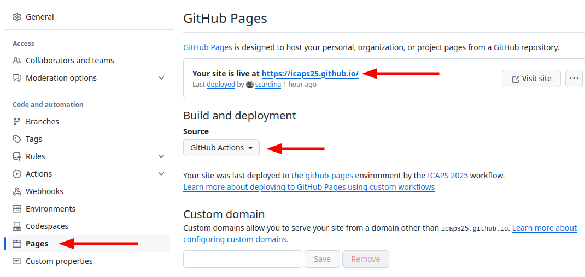

# icaps2025.github.io

Website for the ICAPS 2025 conference held in Melbourne, Australia - November 9-14, 2025.

This site is published via a GH Action workflow to the following GH-pages: 

https://icaps25.github.io/

## Framework: Hugo + Deployment to GH-pages via GH Actions

The site is built with [HUGO](https://gohugo.io) framework for automated generation of _static_ web content.

All development of the website is meant to happen in this repo. When changes are pushed to branch `main`, a GH Actions workflow:

1. first _builds_ the static pages (by running `hugo`); and then
2. _deploys_ the site into [github-pages](https://docs.github.com/en/pages/getting-started-with-github-pages/configuring-a-publishing-source-for-your-github-pages-site).

See below for how to locally develop the site and how to publish automatically.

### Tools used

- [HUGO](https://gohugo.io) framework for production of static web pages.
- [Weather Widget](https://weatherwidget.org/): for the weather widget at the conference location.

## Development

It is convenient to develop and test locally your site _before_ pushing it to the remote repo (which kicks off the deployment workflow to re-build the site).

To test your site locally, just run the following to build the site and bringing up a local server for it:

```shell
$ hugo server
...
Built in 19 ms
Environment: "development"
Serving pages from disk
Running in Fast Render Mode. For full rebuilds on change: hugo server --disableFastRender
Web Server is available at http://localhost:1313/ (bind address 127.0.0.1) 
Press Ctrl+C to stop
```

The site can be accessed locally at http://localhost:1313/ and is locally produced in folder `public/` (not tracked by git).

Once happy with the changes to the site, push the changes to the remote repo for building and deployment.

### Deploy to GH-pages via GH Actions

GH already provides Hugo workflows to build the site from your sources (i.e., produce the static web pages) and deploy the site to GH-pages.

All you need to set-up the _Build and deployment_ mode of this repo as follows:



There will be built-in scripts for Hugo that will produce file
[.github/workflows/hugo.yml](.github/workflows/hugo.yml).

The workshop will trigger when there is a new push into `main` branch.

The webpage will be accessible at `https://<username>.github.io`

### Deployment elsewhere

Hugo can produce the set of static pages that can be copied to any WWW server.

To (only) build the static pages without running the local server:

```shell
$ hugo -t mainroad -d <FOLDER TO BUILD STATIC PAGES>
```

If `-d` is not given, it will be produced in folder `public/`.

If you want to deploy the built web pages to another location than GH (e.g., your uni servers), just copy the content under `public/`.

If the static web pages are meant to live on another web-site, you can use the [`deploy.sh`](deploy.sh) script for copying the built site, and pushing the changes.
